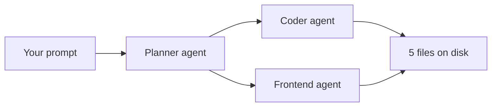

# Orchestrate a Multi-Agent Build with One Prompt

Orchestration is the difference between one agent doing everything in sequence and a lead agent that plans, splits the work, and runs specialists in parallel. This lab puts that behavior under test with a single prompt: a planning phase before any file is written, a parallel phase where two specialists own disjoint files, and a trace that proves the orchestrator actually invoked them. By the end you hold a working temperature converter in `src/scratch/delegation-test/` and a pass-or-fail audit you can run in under a minute.

> Note: The trace examples in this guide come from a workspace session with agent mode and custom agents configured. On GitHub.com, subagents follow the same automatic-delegation rules described in the Copilot documentation.

## What orchestration has to prove

An orchestrator is judged on its tool calls, not its prose. The prompt embeds its own grading criteria, so the outcome is checkable instead of vibes:

| Criterion | Where to look | Failure mode |
|-----------|---------------|--------------|
| An `## Execution Plan` block with phases | First response | Work starts without a plan |
| A Planner call before any build | Chat trace | No Planner invocation, or the plan is invented after the fact |
| Coder and Frontend in one parallel phase | Chat trace | Serial execution, or one agent touching the other's files |
| Actual agent tool invocations | Chat trace | Prose saying "I would delegate to Coder" with no tool call |
| Files on disk in `src/scratch/delegation-test/` | File explorer | Files missing, or contract mismatch between them |
| No `team-playwright` call | Chat trace | The prompt has no e2e wording, so any e2e agent call is a rule violation |

The failure to spot: the model narrates the orchestration instead of performing it. The summary reads fine; the trace is empty.

## Run the test

1. Open this repository as your workspace session. Files are available automatically; no attachments needed.
2. Start a fresh chat so no earlier context contaminates the run.
3. Paste the prompt below and submit it.

```text
Build a small standalone utility page under src/scratch/delegation-test/: a
temperature converter (Celsius <-> Fahrenheit) with the conversion logic kept
separate from the markup, plus a plain HTML page that uses it and a short
readme explaining how to open it. Do not touch anything outside that folder.
```

The task is shaped to force every orchestration behavior at once: non-trivial enough that the lead agent must plan first, three deliverables that split cleanly across Coder (logic plus page wiring) and Frontend (markup and styling) in one parallel phase with no file overlap, and no e2e wording, so a `team-playwright` call would be a rule violation you can spot.

## Read the trace like a reviewer

The plan is only the beginning. The pass condition lives in the trace, so read it as an audit of who was called, in what order, and with which files.



1. Confirm the first response opens with an `## Execution Plan` block that names the phases and the scope guard.
2. Confirm the trace shows a `Planner` invocation that returns the file layout and the shared contract: element ids `celsius-input`, `fahrenheit-input`, `message`, the functions `celsiusToFahrenheit` and `fahrenheitToCelsius`, and the script order `converter.js` then `app.js`.
3. Confirm a single parallel phase contains both the `Coder` and `Frontend` invocations. Coder owns `converter.js`, `app.js`, `readme.md`; Frontend owns `index.html`, `styles.css`. No file appears in both briefs.
4. Reject the run if the trace narrates the split ("I would delegate to Coder") instead of invoking the agents. That is the standard failure mode.

Expected outcome: at least three agent invocations in the trace (Planner, Coder, Frontend), with Coder and Frontend batched in one parallel phase.

## Verify the artifact

A clean trace is half the result. The other half is whether the parallel agents produced parts that fit together:

```powershell
git status --short -- src/scratch/
```

Expected: the only change reported is the new `src/scratch/delegation-test/` folder. Nothing outside it was touched.

Then open `src/scratch/delegation-test/index.html` in a browser and check the known conversion pairs:

| Celsius | Fahrenheit |
|---------|------------|
| 0 | 32 |
| 100 | 212 |
| -40 | -40 |
| 37 | 98.6 |

Expected: typing in either field updates the other, negative values work, and entering `abc` shows "Enter a valid number" without clearing the other field. A converter that fails here usually means the two agents worked from different contracts, not that either wrote bad code.

## Troubleshooting

| Symptom | Likely cause | Fix |
|---------|--------------|-----|
| The response narrates the split but the trace has no tool calls | The model is describing orchestration instead of performing it | Treat the run as a fail and re-run on a harness that emits real agent invocations |
| No Planner call before the build | The lead agent judged the task too simple to plan | The prompt is non-trivial by construction; a plan phase is mandatory |
| Coder and Frontend run serially | No parallel batch in the trace | Check for a single phase containing both invocations, not two sequential ones |
| Both agents wrote `index.html` | The shared contract was not stated in the briefs | Re-run with the contract (ids, functions, script order) embedded in both briefs |
| Some files exist, others do not | The run stopped after the first agent | A pass needs all five files on disk |

## Summary

You ran one prompt that exercises the full orchestration path: plan first, a parallel Coder plus Frontend split with no file overlap, and a trace you can audit for real tool invocations. You can now:

- Tell narrated orchestration ("I would delegate to Coder") apart from real agent tool calls in a trace
- Fix a shared contract before fanning out: element ids, function names, script order
- Confirm scope with `git status` that nothing outside the target folder changed
- Recognize an invented rule violation, such as a `team-playwright` call with no e2e wording

Next: reuse the same prompt shape to audit orchestration behavior in your own multi-agent workflows.

## Links & Resources

- [Using agent mode in GitHub Copilot](https://docs.github.com/en/copilot/how-tos/chat-with-copilot/chat-in-ide) - how agent mode plans, edits, and iterates on multi-step tasks
- [Creating custom agents for Copilot](https://docs.github.com/en/copilot/how-tos/copilot-on-github/customize-copilot/customize-cloud-agent/create-custom-agents) - how to configure the subagents that orchestration routes to
