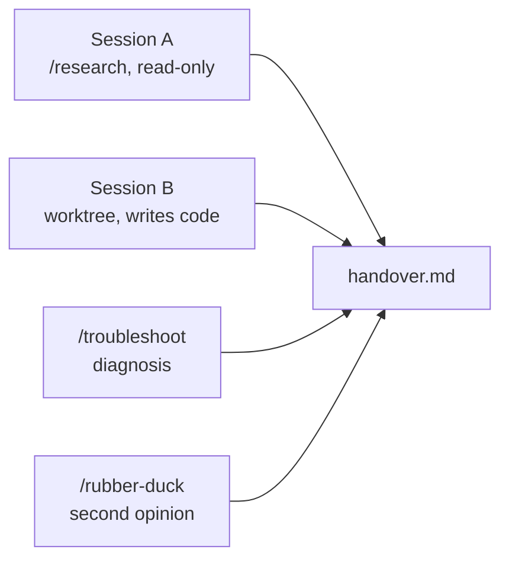

# Run Two Isolated Agent Sessions and Reconstruct What They Did

One agent in one sidebar chat is easy to supervise. Four agents across two projects, one of them rewriting files while another reads them, is where teams lose work and stop trusting the tool. This lab puts you in that situation on purpose, in a controlled way, and hands you the four habits that make it safe: isolate the writing session in a worktree, keep the reading session visible beside it, review the run with a different model before you accept it, and reconstruct afterwards what actually happened.

By the end you hold a `handover.md` in `src/scratch/session-lab/` that was assembled from four different session surfaces, not from your memory of the afternoon.

> Note: Budget 40 minutes. Feature availability is version-gated, so each step names the VS Code release that introduced what it uses. If your build predates a step, read its Expected line and move on rather than upgrading mid-lab.

## What you'll build

- A cited scoping report from a read-only `/research` session
- A working slug generator built by a second session in its own Git worktree, so your working tree never moves
- A diagnosis of a deliberately broken run, produced by `/troubleshoot` rather than by you reading logs
- A second-opinion review from `/rubber-duck` listing what the working agent missed
- `handover.md`, one file assembling all four so the next person does not repeat the session



## Prerequisites

- VS Code 1.135 or later, signed in to GitHub Copilot with your GitHub account
- `chat.agentHost.enabled` turned on in Settings, which is the single control point since the `ChatAgentHostEnabled` policy was removed in 1.132
- This repository open as your workspace, on a branch you are willing to leave dirty
- Git on your PATH, since two steps read worktree state from the command line

Everything the lab writes lands under `src/scratch/session-lab/`. Cleanup is the last step and removes all of it.

> Note: The Agents window and its session-management surface are VS Code features, so every step below names VS Code. The session record itself is account-scoped rather than editor-scoped, so the `/chronicle` query in Step 10 also reaches sessions you ran from Visual Studio, a JetBrains IDE, GitHub.com, or the Copilot CLI under the same GitHub account.

## Step 1: Open the Agents window and confirm the host (3 minutes)

The Agents window is a companion window, not a panel inside the editor, and that separation is the point: agent work stops competing with the file you are reading for screen space. The agent host underneath it is what makes a session survive a window reload later in this lab, so confirm it is on before you start anything long-running.

1. Open the Command Palette and run the command that opens the **Agents** window.
2. In Settings, search for `chat.agentHost.enabled` and confirm it is enabled.
3. Note which harness the window offers in its picker. Copilot, Claude, and Codex all run on the same host.

Expected: a separate window with its own Sessions list, empty on first open, and a harness picker showing at least one backend. The editor sidebar chat is still available and independent of it.

Read [Agent Host Protocol (AHP vs ACP)](../../demos/04-agent-sessions/02-host-protocol/) if you want the reason the host, not the client, owns session state.

## Step 2: Scope the work with a read-only research session (6 minutes)

Session A does no damage by construction. The research agent reads and cites, it never proposes an edit, so it is the right place to find out what a repository already does before a second agent starts writing into it.

1. In the Agents window, start a new session against this repository.
2. Paste the prompt below and send it.

```text
/research Summarize how this repository organizes its runnable sample
projects under src/, and cite the files and folders that show the
convention. Name the dependency manifest each project type carries.
```

3. When the report arrives, open two of its citations and check that each one actually supports the claim attached to it.

Expected: a Markdown report whose claims carry links, with no approval prompt for a write action at any point. A report that names `src/qr-server` and `src/hr-mcp-server` and points at their manifests is a good one. A report that describes conventions without naming a single path has failed its own citation test, so re-ask with a narrower question.

4. Create the folder, then save the report into it as `research.md`.

```bash
mkdir -p src/scratch/session-lab
```

> **Tip:** Keep the question specific enough that a correct answer must name files. "How does this repo work" produces fluent text with nothing to verify.

## Step 3: Start a writing session in its own worktree (7 minutes)

Session B writes code. If it writes into the same working tree that Session A is reading, you have a race, and the tell is a diff that contains changes nobody asked for. The worktree checkbox (1.129, extended to the Claude and Codex harnesses in 1.130) puts the session in its own checkout with one click.

1. Start a second session in the Agents window.
2. Before sending the first prompt, tick the worktree checkbox so the session runs in an isolated checkout.
3. Send this prompt:

```text
Create src/scratch/session-lab/slugify.js: a single exported function
slugify(input) that lowercases, trims, replaces runs of non-alphanumeric
characters with a single hyphen, and strips leading and trailing hyphens.
Add src/scratch/session-lab/slugify.test.js covering the ordinary case and
the empty string. Do not touch anything outside src/scratch/session-lab/.
```

4. While it runs, check from a terminal in your main window that the isolation is real:

```bash
git worktree list
git status --short -- src/scratch/
```

Expected: `git worktree list` shows a second entry beside your main checkout, and `git status` in your main tree reports nothing under `src/scratch/` except the `research.md` you saved by hand. The new JavaScript files exist in the worktree, not here. That gap is the whole point of the step.

## Step 4: Run both sessions side by side and send one to the background (4 minutes)

Side-by-side layout arrived in 1.123 and exists so two related sessions stay visible at once. Background send (1.124) is the other half: a session you are not watching should still be working.

1. Arrange Session A and Session B side by side.
2. Pin Session A, the research session you keep referring to, and maximize Session B while you drive it.
3. Ask Session B for a follow-up, then send it to the background and return to Session A.
4. Press Ctrl+R to open the session picker and switch between the two by name.

Expected: the backgrounded session keeps making progress while it is not on screen, and its entry in the Sessions list shows activity rather than sitting frozen. The picker lists both sessions and switches without reloading either.

## Step 5: Ask a side question without interrupting the turn (3 minutes)

A clarifying question used to cost you the running turn. Side chats (1.132) answer alongside the conversation and share its context and its prompt cache, so the detour stays cheap.

1. With Session B still working, type in its chat input:

```text
/btw What does the worktree checkbox actually change about where this
session writes files?
```

2. Read the answer, then return to the main conversation.

Expected: the side chat answers in its own thread while the main turn continues, and the running turn is neither cancelled nor restarted. Compare that with what a normal follow-up prompt would have done to the queue.

## Step 6: Reload the window and prove the sessions survived (3 minutes)

This is the step that separates a durable session from a chat transcript. The host owns the state, so the client going away should not cost you the run.

1. In the Agents window, run the Command Palette action **Developer: Reload Window**.
2. Reopen the Sessions list.

Expected: both sessions are present after the reload, with their transcripts intact and any background work either finished or still in flight. If a session is gone, `chat.agentHost.enabled` was off in Step 1 and the session was client-owned.

## Step 7: Break a run on purpose and diagnose it with /troubleshoot (5 minutes)

Everything so far worked. Sessions fail in ways the transcript alone does not explain, and `/troubleshoot` (1.127) reads the session's own record of prompts, tool calls, and errors instead of making you scroll. It reaches local and remote agent-host sessions alike, which the old Agent Debug Panel could not.

1. In Session B, send a prompt that will hit a wall:

```text
Run the test suite for src/scratch/session-lab using the project's
configured test runner, then report the results.
```

There is no configured runner in that folder, so the run stalls or errors.

2. Do not read the raw output. Send this instead:

```text
/troubleshoot Analyze this session and tell me which step failed and why.
```

3. Save the diagnosis for the handover.

Expected: a diagnosis that names the failing step and a likely cause, such as a missing runner or an absent manifest, rather than an echo of the error string. A response that only repeats the error text is the failure mode to notice; ask it to identify the failing tool call specifically.

4. Act on it. Have the session add a minimal `package.json` with a test script in `src/scratch/session-lab/`, then re-run.

Expected: the second run reports test results instead of stalling.

## Step 8: Get a second opinion from a different model (4 minutes)

The agent that just wrote the code is the worst available reviewer of it, because the reasoning that produced the code also produces the review. `/rubber-duck` (experimental in 1.135) hands the session to a complementary model and reports what it thinks was missed. It changes nothing on disk.

1. Read Session B's own summary of what it built.
2. Then send:

```text
/rubber-duck
```

3. Put the two side by side and mark every finding the working agent never mentioned.

Expected: findings the original run did not raise, and for this task the likely ones are input that is not a string, a string of only punctuation collapsing to an empty slug, and Unicode characters outside the ASCII range. Treat them as candidates, not verdicts.

4. Prompt Session B to fix only the findings you judged worth acting on.

> **Tip:** Run this at the moment you would otherwise say "looks right, ship it". That is where it is cheapest and where it catches the most.

## Step 9: Read the run instead of re-reading the transcript (3 minutes)

A long run leaves three navigable records, and none of them is the scroll bar. File-level diff statistics (1.130) tell you the size of what changed, the prompt timeline (1.134) puts one dot per prompt in the gutter with line change counts, and Find in Chat searches content that is not currently rendered.

1. Open the session detail pane and read the file-level diff stats for Session B. Note insertions and deletions per file.
2. Use the prompt timeline in the gutter to jump back to the prompt from Step 7, and read its change counts.
3. Press Ctrl+F and search the conversation for `slugify`.

Expected: the search finds matches inside collapsed work summaries and expands them, which plain scrolling would have skipped. The diff stats give you a per-file total without opening a single file.

## Step 10: Reconstruct the session and write the handover (2 minutes)

Sessions sync to your GitHub account, so `/chronicle` queries the record rather than your live workspace. This is the standup answer that does not require you to have taken notes.

1. In either session, send:

```text
/chronicle Summarize the sessions I ran today and list which ones
touched src/scratch/session-lab.
```

2. Assemble `src/scratch/session-lab/handover.md` with five sections: the research findings from Step 2, what Session B built, the `/troubleshoot` diagnosis from Step 7, the `/rubber-duck` findings you accepted and rejected from Step 8, and the chronicle summary.

Expected: the chronicle names both sessions and links back to them, and every section of `handover.md` traces to a surface rather than to your recollection. That traceability is the deliverable.

## Cleanup

Review the worktree's changes and discard them rather than merging. In your own project you would merge; here the branch is scratch work.

```bash
git worktree list
git worktree remove --force <path-from-the-list-above>
git branch -D <branch-the-session-created>
```

Then delete the `src/scratch/session-lab/` folder from your main tree and confirm the repository is clean.

```bash
git status --short -- src/scratch/
```

Expected: an empty status under `src/scratch/`, and `git worktree list` showing only your main checkout.

## Troubleshooting

| Symptom | Likely cause | Fix |
|---------|--------------|-----|
| Sessions vanish after the reload in Step 6 | `chat.agentHost.enabled` is off, so the session was client-owned | Enable it in Settings and restart the lab from Step 3 |
| `git worktree list` shows only one entry | The worktree checkbox was ticked after the first prompt was sent | Start a fresh session and tick it before sending anything |
| The main tree fills with the session's new files | The session is not isolated, so Steps 3 and 4 are racing | Confirm the isolation with `git status` before you background anything |
| `/research` returns prose with no citations | The question was too broad to have a file-level answer | Re-ask naming a folder or a convention it must point at |
| `/troubleshoot` only repeats the error text | It was asked to explain rather than to locate | Ask which tool call failed and at which step |
| `/rubber-duck` agrees with everything | The reviewing model resolved to the session's own model | Check the harness picker; the value comes from a complementary model |
| `/chronicle` finds nothing from today | Session sync has not run, or a different GitHub account is signed in | Check the account menu in the Activity Bar and retry |

## Summary

You ran two agents at once with one of them writing, and you finished with your working tree exactly where you left it. You can now:

- Isolate a writing session in a Git worktree and verify the isolation from the command line rather than trusting the checkbox
- Keep a reading session and a writing session both visible, and background the one you are not driving
- Ask a side question with `/btw` without paying for it with the running turn
- Diagnose a failed run with `/troubleshoot` instead of reading logs, and tell a real diagnosis from an echoed error
- Treat `/rubber-duck` findings as candidates and decide which earn a follow-up turn
- Reconstruct a day of sessions with `/chronicle` and hand the result to someone else as one file

Next: take the same four habits to a remote agent session over SSH or a dev tunnel, where the isolation is a whole machine rather than a checkout.

## Links & Resources

- [VS Code 1.129 release notes](https://code.visualstudio.com/updates/v1_129) - the worktree checkbox and session-management tools for agents
- [VS Code 1.130 release notes](https://code.visualstudio.com/updates/v1_130) - worktrees for the Claude and Codex harnesses and file-level diff stats
- [VS Code 1.132 release notes](https://code.visualstudio.com/updates/v1_132) - side chats with `/btw` and removal of the `ChatAgentHostEnabled` policy
- [VS Code 1.134 release notes](https://code.visualstudio.com/updates/v1_134) - Find in Chat and the prompt timeline
- [VS Code 1.135 release notes](https://code.visualstudio.com/updates/v1_135) - the experimental `/rubber-duck` command and session information pills
- [Session Management](../../demos/04-agent-sessions/04-session-management/) - the full feature timeline this lab draws its steps from
- [Troubleshooting Agent Sessions](../../demos/04-agent-sessions/07-troubleshooting/) - what `/troubleshoot` inspects and when to reach for it
