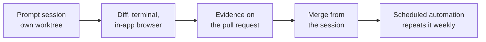
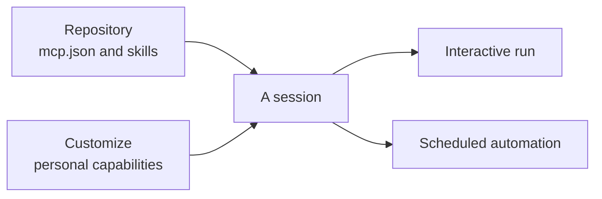

# Ship a Verified Pull Request from the Copilot Desktop App

Agent work that lives in an editor sidebar competes with the file you are reading, and reviewing it means leaving the session for a terminal, a browser, and the pull request page. The Copilot desktop app collapses that into one surface: the agent runs in its own worktree, and the diff, the terminal, the browser, and the merge button are all in the window where you watched it work. This lab walks one small change through that surface from an empty prompt to a merged pull request, then schedules the same work to repeat without you.

By the end you hold a merged pull request in your own fork that changes the Food Shop heading, carries a `docs/agent-runbook.md` recording the session settings that produced it, and has screenshot evidence the agent attached itself.

> Note: Budget 35 minutes. The app ships fast and this lab tracks release v1.1.14, so when a menu has moved, the changelog in the `github/app` repository is the authoritative record of what changed.

## What you'll build

- A prompt session running in its own worktree, with the isolation proven from your own terminal rather than assumed from a checkbox
- A validated change to `src/food-app/food-shop`, checked as a diff, as a test run, and as a rendered page
- A pull request whose description carries a screenshot the agent produced, not one you pasted
- `docs/agent-runbook.md`, the settings record that lets a teammate reproduce the run
- A scheduled automation that re-runs the work weekly, with session cleanup configured before it starts filling the list



## Prerequisites

- The GitHub Copilot desktop app installed on macOS (Apple Silicon), Windows, or Linux, signed in with a GitHub account on any Copilot plan, or configured against a bring-your-own-key endpoint
- Your own fork of this class repository, cloned locally, so the pull request you open is yours to merge
- Node.js and `npm` on your PATH, since the Food Shop app is an Angular project the session builds and serves
- Git on your PATH, because two steps read worktree state from your own terminal rather than from the app
- VS Code 1.135 or later for the final step, which continues an app session in the editor

Everything the lab changes lands in your fork on a branch the app creates. Cleanup is the last step and removes the branch, the worktree, and the automation.

## Step 1: Set the session defaults before the first run (4 minutes)

Sessions and automations inherit their capabilities, authority, and model from settings you choose once, so getting them wrong shows up later as an agent that lacks a tool or stalls on approvals. **Customize** is the single management view for the personal half of that: plugins, skills, MCP servers, and canvases that follow you rather than the repository.

1. Open **Customize** and inventory what is already installed under plugins, skills, MCP servers, and canvases. Note for each whether it came from a repository or from your own account.
2. In Sessions settings, set the **worktree location** to a path on a fast local disk, not a synced folder such as OneDrive or Dropbox.
3. Turn the all-repositories **worktree** toggle on, so new sessions stop asking where to work.
4. Open a scratch session against your fork and inspect the current permission mode:

```text
/permissions show
```

5. Set the mode explicitly for this lab:

```text
/permissions assisted
```

Expected: Customize lists your personal capabilities with a source for each, the worktree location shows the local path you entered, and `/permissions show` reports `assisted` after the second command where it reported something else before. In `assisted`, reads run freely while writes and commands ask, which is the mode you want while you are still watching.

> **Tip:** Pick the loosest mode the blast radius justifies. A session in a throwaway worktree tolerates `allow-all`; a session pointed at your main checkout does not.

## Step 2: Open a session from a prompt and steer it from the Plan tab (5 minutes)

A session starts from a GitHub issue, a freeform prompt, or a pull request already in flight. A prompt is the escape hatch for work with no tracking artifact yet, which is exactly this change. Before the agent gets far, the **Plan** tab shows the steps it intends to take, and steering a plan costs one sentence where steering a finished diff costs a review.

1. Create a new session against your fork and choose **New worktree** as its space.
2. In the composer menu, set the model, the reasoning effort, and the context window together. Use a low reasoning effort here; this change does not justify more.
3. Paste this prompt and send it:

```text
In src/food-app/food-shop, change the main heading of the shop landing
page to "Fresh Food, Fast" and add one unit test that asserts the new
heading text renders. Also create docs/agent-runbook.md recording the
model, reasoning effort, and permission mode this session is running
with. Do not touch anything outside src/food-app/food-shop and docs/.
```

4. Open the **Plan** tab before the first file is written and read the steps. If the plan proposes touching files outside those two paths, say so in one sentence and let it re-plan.
5. While it runs, ask a side question without interrupting the turn:

```text
/btw Which component file actually owns the heading you are changing?
```

Expected: the Plan tab lists concrete steps naming `src/food-app/food-shop` before any diff appears, the `/btw` answer arrives in its own thread, and the main turn is neither cancelled nor restarted by asking. A plan that names no file paths is too vague to steer, so push back and ask for one.

## Step 3: Prove the isolation from your own terminal (3 minutes)

The worktree choice is the reason several agents can work the same repository at once, and it is worth verifying rather than trusting. The check is a command in your own terminal, outside the app entirely.

1. In a terminal at the root of your fork, list the worktrees and check your own status:

```bash
git worktree list
git status --short
```

2. Compare the paths against the worktree location you set in Step 1.

Expected: `git worktree list` shows a second entry under that location beside your main checkout, and `git status --short` in your main tree reports nothing new under `src/food-app/` or `docs/`. The agent's files exist in the worktree, not here, and that gap is the whole point of the step.

## Step 4: Read the diff hunk by hunk (3 minutes)

The diff answers the first question you have about any agent's work: what actually changed. Reading it in the session, next to the conversation that produced it, is what removes the context-switch tax that otherwise makes reviewing agent output slower than writing the code yourself.

1. Open the **Files** tab and then the diff view for the session.
2. Read every changed hunk in order, and confirm the heading change, the new test, and `docs/agent-runbook.md` are the only things touched.
3. If a file outside `src/food-app/food-shop` or `docs/` appears, tell the agent to revert that file and re-check.

Expected: three changed files and no more, with the heading string visible as a removed line carrying the old text and an added line carrying `Fresh Food, Fast`. A diff that also touches configuration or lockfiles is scope creep, and catching it here is cheaper than catching it in review.

## Step 5: Run the checks in the terminal and drive the in-app browser (4 minutes)

The diff tells you what changed, not whether it works. The terminal answers "does it build and pass" and the in-app browser answers "does it behave", and having both in the session means a UI change is verified in the same window where you read its diff.

1. Open the **terminal** in the session and install and test:

```bash
cd src/food-app/food-shop
npm install
npm test
```

2. Start the app in the same terminal:

```bash
npm start
```

3. Open the **in-app browser** at the local URL the dev server prints, and look at the landing page.

Expected: the test run reports the new heading test passing with no other test broken, the dev server prints a `localhost` URL, and the page in the in-app browser shows `Fresh Food, Fast` where the old heading used to be. If the test passes but the page still shows the old text, the agent edited a template that is not the one rendered, so send it back with the URL and what you see.

## Step 6: Have the agent attach its own evidence (2 minutes)

A reviewer who never checks out the branch cannot see what you just saw in the browser. An agent can attach screenshots, diagrams, and recordings to a pull request description, which turns "I changed the heading" into a picture of the heading.

1. With the app still running and the browser still open, send:

```text
Take a screenshot of the shop landing page showing the new heading and
attach it to the pull request description, with one sentence naming the
file that renders it.
```

2. Open the pull request from the session and read its description.

Expected: the pull request description carries an image of the rendered page plus the file name, produced by the agent rather than pasted by you. That is the same evidence you would otherwise capture by hand, and for a UI change it is often the difference between a review that lands and one that stalls.

## Step 7: Work a review comment and merge from the session (4 minutes)

Review threads are where a pull request quietly goes stale, because a comment written against a line that has since moved still looks live. The app badges those **Outdated** and lets you delete stale local comments from the Changes view before you carry them into a merge.

1. On the pull request, leave a review comment on the heading line:

```text
Use title case here so it matches the other section headings.
```

2. Ask the agent to resolve it in the session, then re-read the diff:

```text
Address the open review comment on the heading line and push the change.
```

3. Find your original comment in the Changes view and confirm it now carries the **Outdated** badge, then delete it if it no longer applies.
4. Re-run `npm test` in the session terminal, then **merge the pull request** from inside the session.

Expected: the heading line changes again, your first comment picks up the **Outdated** badge because the line it referenced has moved, the tests still pass, and the merge completes without you leaving the app. Note what Agent Merge does and does not give you: it works the threads, and it decides nothing about correctness.

## Step 8: Confirm the repository's own tools reached the session (3 minutes)

Repository MCP servers and skills sync into app sessions automatically, so an agent has the same tools here that it has in the editor. This is why an unattended automation is dependable: the capabilities are resolved from the repository, not from whichever machine happened to start the run.

1. In the session, ask what it actually has:

```text
List the MCP servers and skills available to you in this session, and
say for each whether it came from this repository or from my personal
Customize settings.
```

2. Check the answer against the repository: `.vscode/mcp.json` defines the MCP servers, and `.github/skills/` holds the repository skills.
3. Compare that list against the personal inventory you took in Step 1.

Expected: the repository's servers and skills appear in the answer without you having configured anything in the app, and the session's total is the union of the repository scope and your personal scope. Anything a teammate or an unattended automation needs has to live in the repository, because personal capabilities do not travel.



## Step 9: Promote the work into a scheduled automation (4 minutes)

A prompt that was worth running once is often worth running weekly, and attaching a schedule is what turns it into unattended work. What automation removes is the starting of the job, never the reviewing of it: the run still produces an ordinary session and an ordinary pull request.

1. Open Sessions settings and configure **Session cleanup** first: set an archival window for inactive sessions that is longer than your usual review turnaround, plus a deletion schedule for archived ones.
2. Create a **scheduled automation** from a prompt, on a weekly interval:

```text
Check src/food-app/food-shop for headings that no longer match the
title-case convention, fix any you find, update docs/agent-runbook.md
with what changed, and open a pull request.
```

3. Trigger the automation once rather than waiting for its interval, and let it finish.
4. Open the resulting session, review its diff with the same loop you used in Steps 4 and 5, and merge or discard the pull request.

Expected: the automation appears in the schedule list with its interval, the manual trigger produces a normal session you can open, and nothing merges on its own. Configure cleanup before the first automation rather than after, because the interval you would pick while looking at six sessions is not the one you would pick while looking at two hundred.

> **Tip:** Set the archival window longer than your slowest review turnaround, or the app will archive a session you were still reading.

## Step 10: Continue the session in your editor (3 minutes)

The app and the editor are no longer sealed off from each other. When a long agentic run turns into a tight inner loop on one file, the editor is the better surface, and you can pick the session up there rather than starting over.

1. In VS Code, enable `chat.agentSessions.showExternal` in Settings.
2. Open the Sessions list and find one of the sessions you ran in the app.
3. Continue it in the editor with a short follow-up question about the change you merged.

Expected: the app's sessions appear in the VS Code Sessions list alongside editor-native ones, and the continued conversation carries its history rather than starting cold. Use the app when several agents work across issues and pull requests at once, and the editor when the work narrows to one file.

## Cleanup

Remove the automation first, so it does not fire against a branch you are about to delete.

1. Delete the scheduled automation from the schedule list, and discard any pull request it opened that you did not merge.
2. Remove the worktree the session created, from your own terminal:

```bash
git worktree list
git worktree remove --force <path-from-the-list-above>
```

3. Delete the session branches in your fork, and confirm your main checkout is clean:

```bash
git status --short
git worktree list
```

Expected: an empty status, `git worktree list` showing only your main checkout, and no automation left in the schedule list. Your merged pull request stays; it is the deliverable.

## Troubleshooting

| Symptom | Likely cause | Fix |
|---------|--------------|-----|
| `git worktree list` shows only one entry in Step 3 | The session was created as a local repository clone rather than a worktree | Start a new session and pick **New worktree** before sending the first prompt |
| The agent's files appear in your main checkout | The all-repositories worktree toggle is off and the session inherited your working tree | Turn it on in Sessions settings and rerun from Step 2 |
| Every tool call stops for approval | The permission mode is `manual` | Set `assisted` with `/permissions` and resend the prompt |
| `npm test` passes but the browser shows the old heading | The agent edited a template the running page does not render | Send it the URL and the text you see, and ask which template the route actually uses |
| The pull request description has no screenshot | The in-app browser was closed before the attach request | Reopen the local URL, then repeat the Step 6 prompt |
| The session lists no repository skills or MCP servers | The session is attached to a repository without `.vscode/mcp.json` and `.github/skills/` | Confirm which repository the session is open against and reopen it against your fork |
| The automation never fires | It was saved without an interval, or session cleanup deleted its output before you looked | Reopen the automation, confirm the interval, and widen the archival window |

## Summary

You took one small change from a blank prompt to a merged pull request without leaving the app, and your own working tree never moved. You can now:

- Set the capabilities, permission mode, and model that every session and automation inherits, before the first run rather than after
- Open a session from a prompt in its own worktree and verify the isolation from your own terminal instead of trusting the checkbox
- Steer an agent from the Plan tab, and ask a side question with `/btw` without paying for it with the running turn
- Run the full validation loop in one window: the diff for what changed, the terminal for whether it passes, the in-app browser for whether it behaves
- Make the agent produce the evidence a reviewer needs, and tell an **Outdated** comment from a resolved one before merging
- Tell repository-scoped capabilities from personal ones, and put anything an unattended run needs in the repository
- Promote a working prompt into a scheduled automation, with session cleanup configured before the list fills up

Next: take the same validation loop to [Agentic DevOps](../../demos/07-agentic-devops/), where the pull request you merge here is the one a pipeline picks up.

## Links & Resources

- [GitHub Copilot app](https://github.com/features/ai/github-app) - the desktop agents experience, session entry points, and the in-session validation loop
- [GitHub Copilot app changelog](https://github.com/github/app/blob/main/changelog.md) - the release-by-release record this lab tracks at v1.1.14
- [Reviewing proposed changes in a pull request](https://docs.github.com/en/pull-requests/collaborating-with-pull-requests/reviewing-changes-in-pull-requests/reviewing-proposed-changes-in-a-pull-request) - reading a diff and handling outdated review comments before merging
- [VS Code 1.135 release notes](https://code.visualstudio.com/updates/v1_135) - `chat.agentSessions.showExternal` and continuing external agent sessions in the editor
- [Sessions from Issues, Prompts & Pull Requests](../../demos/06-copilot-app/02-sessions/) - the three entry points and the worktree versus clone choice
- [The Validation Loop](../../demos/06-copilot-app/03-validation-loop/) - what each in-session capability answers and why Agent Merge is not a correctness check
- [Configuring the App: Customize, Permissions & Models](../../demos/06-copilot-app/06-configuration/) - the permission modes and the composer menu this lab sets in Step 1
