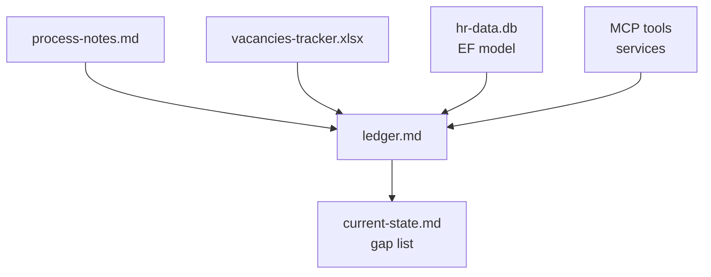

# Lab: Harvest the Current State of Vacancy Tracking

HR already fills open positions today, just not in the HR MCP server: a manager keeps a vacancies workbook, re-copies staff from the HR assistant into a second sheet, and types candidate names by hand. Planning a vacancies feature without that picture builds the wrong thing. In this lab four Copilot subagents harvest the process log, the workbook, the database and the code in parallel into one ledger, the agent writes a current-state document with a gap list, and you catch the claim a friendly review lets through.

The theory behind each step is in [Brownfield Analysis: Harvest the Current State](../../../demos/09-plan-spec-deliver/01-analysis/readme.md). Everything the lab reads is in [hr-sources/](./hr-sources/) and [src/hr-mcp-server](/src/hr-mcp-server/readme.md); nothing else needs to be cloned.

> Note: Budget 20 minutes. The run writes two files to `labs/09-plan-spec-deliver/01-analyze/hr-current-state/` and changes no code; delete that folder to start over.

## What you will build



| File | What it represents |
| --- | --- |
| [hr-sources/process-notes.md](./hr-sources/process-notes.md) | One week of the restaurant manager recording each hiring step, the tool used and the minutes spent |
| [hr-sources/vacancies-tracker.xlsx](./hr-sources/vacancies-tracker.xlsx) | The workbook HR runs today: a `Vacancies` sheet with a `Days Open` formula and a hand-copied `Staff Copy` sheet |
| [src/hr-mcp-server](/src/hr-mcp-server/readme.md) | The system the feature lands in: five employee tools over MCP, SQLite storage in `hr-data.db` |

## Prerequisites

- GitHub Copilot CLI signed in, started from the repository root
- Python with `openpyxl` installed (`pip install openpyxl`), because the agent reads the workbook with a script it writes
- `hr-data.db` present in `src/hr-mcp-server`; if the server has never run, start it once with `dotnet run` in that folder

> Note: If you routed the CLI to your own model provider in [Bring Your Own Key in the Copilot CLI](../../../demos/08-governance/02-cost-byok/02-byok-copilot-cli/readme.md), remove the `COPILOT_PROVIDER_*` variables for this session so the subagents run on a hosted Copilot model.

## Step 1: Harvest four sources in parallel (10 minutes)

Each source needs a different reader: the process log is prose, the workbook is formulas, the database is a schema, the server is code. Subagents are stateless, so the prompt creates the ledger first and names it in every brief.

Start the CLI in fleet mode so the agent may run subagents in parallel:

```powershell
copilot --fleet
```

Paste the prompt:

```text
Analyze the current state of how HR fills open positions today, before we plan a vacancies feature for the HR MCP server. The sources are src/hr-mcp-server (ignore bin, obj and publish), the workbook labs/09-plan-spec-deliver/01-analyze/hr-sources/vacancies-tracker.xlsx and the process log labs/09-plan-spec-deliver/01-analyze/hr-sources/process-notes.md.

First create the shared ledger labs/09-plan-spec-deliver/01-analyze/hr-current-state/ledger.md with four empty headings: Process, Excel, Data structure, Implementation.

Then use your task tool to run four general-purpose subagents in parallel (not explore agents, which cannot write files). Tell each subagent the ledger path and to write its findings under its own heading in that file, and nothing else, with the file, sheet, cell or query behind every finding:
1. Process: the steps, tools and minutes in process-notes.md, and which steps are manual copying between systems.
2. Excel: every sheet, column and formula in vacancies-tracker.xlsx. Read it with a short Python script using openpyxl, loading it once with data_only=False to see the formulas.
3. Data structure: the Entity Framework model in Tools/Models.cs and Data/EmployeeDbContext.cs, and the SQLite schema in hr-data.db read with sqlite3 or a Python script.
4. Implementation: the MCP tools in Tools/HRTools.cs and Services/EmployeeService.cs, and how the server stores and seeds data.

When all four are done, read the ledger and write labs/09-plan-spec-deliver/01-analyze/hr-current-state/current-state.md with four sections: Inventory, How it is used, Limits, Gap list. Compare the Staff Copy sheet with the employees in hr-data.db and list every difference. The gap list rates each capability HR uses in the workbook (record a vacancy, list and close vacancies, find matching employees, days open) as exists, partly exists or missing in the server, each with the ledger line behind it. The ledger and current-state.md are the only files written: do not change any code or the workbook.
```

Expected result: the session dispatches `general-purpose` subagents in parallel, then reports two files. `ledger.md` has the four headings, each filled by a different subagent with a file, cell or query behind every line; `current-state.md` has the four sections.

Read the gap list before moving on. The verified run found what the process log only hints at: `Staff Copy` holds six employees against eight in `hr-data.db`, two names have drifted (Olga Petrova is Olga Ivanova, Ahmed Khan is Ahmed Hassan), and record, list and close, and days open are missing, while find matching employees partly exists because `SearchEmployees` already does the filtering HR repeats by hand.

> Note: In VS Code the same prompt works in Agent mode, which calls subagents through `#agent/runSubagent`. The Plan agent is read-only by default and cannot write the ledger.

## Step 2: Review the current state against the sources (5 minutes)

A current-state document is only useful if every line is true, because the plan written from it takes it as fact. Checking it against the ledger proves consistency; checking it against the sources proves accuracy.

```text
Review labs/09-plan-spec-deliver/01-analyze/hr-current-state/current-state.md against ledger.md in the same folder and against the two source files in labs/09-plan-spec-deliver/01-analyze/hr-sources. For every claim in Inventory and every row of the Gap list, say whether the ledger supports it and whether the source confirms it. List each claim that is wrong or unsupported, with the correct value from the source. Do not change any file.
```

Expected result: a table of claims, each marked as supported and confirmed. In the verified run the review answered "no wrong or unsupported claims found", and it was wrong: the Inventory said the `Vacancies` sheet holds 3 open positions, while its `Status` column reads `Open`, `Open`, `Filled`. The ledger had recorded those three values; the synthesis miscounted them, and a general review confirms what it expects.

## Step 3: Correct the claim with a targeted check (5 minutes)

The check that catches a miscount names the exact range to count. Run it whether or not your review flagged anything:

```text
Read the Status column of the Vacancies sheet in labs/09-plan-spec-deliver/01-analyze/hr-sources/vacancies-tracker.xlsx with openpyxl and count each value. Then correct labs/09-plan-spec-deliver/01-analyze/hr-current-state/current-state.md wherever it states how many vacancies are open, and add the counts as a finding under the Excel heading of ledger.md in the same folder. Change nothing else.
```

Expected result: one line of `current-state.md` changes, from `Vacancies` (4 rows: 3 open positions plus headers) to `Vacancies` (4 rows: 3 vacancies plus headers, of which 2 are Open and 1 is Filled), and the Excel heading of `ledger.md` gains the line `Open: 2, Filled: 1`. The gap list is unchanged: it now rests on an inventory you checked.

## Troubleshooting

| Symptom | Likely cause | Fix |
| --- | --- | --- |
| The Excel subagent reports `ModuleNotFoundError: openpyxl` | `openpyxl` is not installed for the `python` on PATH | Run `pip install openpyxl`, then ask the agent to rerun only the Excel subagent |
| The Data structure section has no schema | `hr-data.db` does not exist yet | Run `dotnet run` in `src/hr-mcp-server` once, stop it, and rerun that subagent |
| Only one heading in the ledger is filled | The agent used explore agents, which cannot write files | Rerun with the prompt as written; it asks for `general-purpose` subagents |

## Summary

You harvested four sources in parallel into one ledger and turned it into a current-state document with a gap list. You can now:

- Split a brownfield analysis by source, so each reader uses the right tool
- Keep subagent findings traceable through a shared ledger with a source behind every line
- Rate each requested capability as exists, partly exists or missing before any plan is written
- Distrust a clean review and confirm counts with a check that names the exact range

A reference solution is checked in at [hr-current-state-solution/](./hr-current-state-solution/): the ledger and the current-state document from a verified run. The gap list is the input [Lab 09.2](../02-plan-spec-deliver/readme.md) and [Planning with Agents](../../../demos/09-plan-spec-deliver/02-planning/readme.md) build on.

## Links & Resources

- [Subagents in VS Code](https://code.visualstudio.com/docs/agents/run/subagents) - parallel subagents and why each one is stateless
- [openpyxl documentation](https://openpyxl.readthedocs.io/en/stable/) - reading workbooks, sheets and formulas from Python
