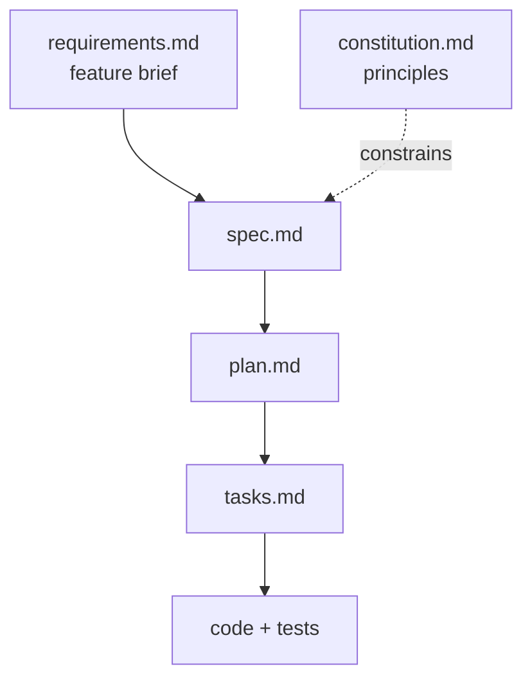

# Lab: Ship a Python Feature with GitHub Spec Kit

You will run the full spec-driven loop once, end to end, on a feature small enough to finish in one sitting: a meeting cost calculator. The point is not the calculator. The point is that you stop at four checkpoints and read the artifact before letting the agent move on, and you see what each checkpoint catches.

Everything this lab needs is in this folder. The feature brief is in [requirements.md](./requirements.md) and the project principles are in [constitution.md](./constitution.md). You will not need to clone anything else.

This is the Python variant of [the spec-driven lab](readme.md). The four checkpoints are identical; the stack is fixed to Python 3.11 with pytest and the standard library, so step 4 has no stack choice to make.

> Note: Budget 45 minutes. The timings on each step are the guide rails; if `/speckit-implement` is still running at 40 minutes, stop it and go straight to step 7, because the artifacts you produced are the deliverable, not the working binary.

## What you will build



## Prerequisites

- GitHub Copilot enabled in VS Code, with agent mode available
- `uv` installed, which provides the `uv tool install` command used to install the Spec Kit CLI
- Python 3.11 or later with `pytest` installed (`python -m pip install pytest`)

## Step 1: Initialize the project (8 minutes)

From this folder, create the Spec Kit project. It has to be its own directory, because Spec Kit expects `.specify/` and `specs/` at the workspace root:

```bash
uv tool install specify-cli --reinstall
specify init meeting-cost --integration copilot
```

Open the new `meeting-cost` folder as your VS Code workspace. Confirm you see `.specify/memory/`, `.specify/templates/` and a `.github/skills/` directory. Open Copilot Chat and type `/speckit-` to confirm the commands are registered.

> Note: The `meeting-cost` folder is scratch work for the lab. It is ignored by this repository, so nothing you generate inside it will show up in `git status` at the repo root.

## Step 2: Establish the constitution (5 minutes)

Open [constitution.md](./constitution.md) in this folder, copy its Principles section, and run:

```text
/speckit-constitution Use these principles for this project: <paste the principles here>
```

Read the generated `.specify/memory/constitution.md`. Check that all six principles survived the generation as principles and that none were softened into suggestions. The constitution template has five principle slots, so the agent tends to demote principle 6, offline by default, into a `Technical Constraints` section; if it did, add it back by hand as `### VI. Offline by Default`. Principle 4, that money is never a float, is the other one to confirm before continuing.

## Step 3: Specify the feature (10 minutes)

Copy the Request, User stories, Acceptance criteria, Constraints and Edge cases sections of [requirements.md](./requirements.md), leaving out the opening paragraph and the Deliberately unstated section, and run:

```text
/speckit-specify <paste the feature brief here>
```

This is the longest checkpoint and the one that pays for itself. Open the generated `specs/001-*/spec.md` and check it against the brief:

| Check | What a good spec.md shows | Failure to catch |
| --- | --- | --- |
| Coverage | All three user stories and all five acceptance criteria are present | A criterion silently dropped |
| Edge cases | All four edge cases from the brief have stated behavior | "Handled gracefully" with no defined outcome |
| The two gaps | Rounding rule and currency are now written down | The agent picked one and never told you |
| No implementation | No class names, no file layout, no library choices | The spec has quietly become a plan |
| No invented input | Attendees are a list of hourly rates, nothing more | A name or label per attendee that the brief never asked for |

Edit `spec.md` directly to fix anything the table catches. The two unstated items in the brief are your decision to make: write down a rounding rule such as "round the total half up to two decimal places, breakdown values unrounded", say what "the breakdown sums to the total" means once only the total is rounded (it sums to the total before rounding), and state that amounts are currency-agnostic decimals. Expect the agent to have resolved both already, typically by fixing the currency to US dollars and rounding every value at display time: that is the agent deciding for you, so overwrite it with your rule.

## Step 4: Plan the implementation (5 minutes)

```text
/speckit-plan Use Python 3.11 with pytest, standard library only. A flat package meeting_cost with two modules, the calculation logic and a CLI wrapper using argparse, plus a __main__.py so it runs as python -m meeting_cost <minutes> <rate> [<rate> ...].
```

Read `plan.md` and confirm it does three things: names the modules and their boundary, gives a rationale for each technology choice, and explicitly verifies the plan against the constitution. That last section is the one worth reading twice, because a plan that proposes `float` for the total has violated principle 4 and the agent should say so itself. Then open `contracts/cli.md` next to `spec.md` and compare its error table with the spec's edge cases: a contract that lists `python -m meeting_cost 60` as an error contradicts the zero attendees rule, and `/speckit-implement` will build and test the contract, not the spec.

## Step 5: Break it into tasks (5 minutes)

```text
/speckit-tasks
```

Open `tasks.md` and check the sequence rather than the wording. Data types and the logic module come before the CLI, and within each user story the tests come first, written to fail before the implementation task that makes them pass. Every acceptance criterion in `spec.md` should map to at least one task, per principle 5. Delete or merge any task that is too vague to verify, such as "handle errors".

## Step 6: Implement (10 minutes)

```text
/speckit-implement
```

Let it work through the task list. Watch which files it touches: anything outside the layout in `plan.md` (the two modules, the package's `__init__.py` and `__main__.py`, `pyproject.toml` and the tests) means it has drifted. If it stops partway, run the command again and it will resume from the first unfinished task.

## Step 7: Verify (2 minutes)

Run the tests, then check the acceptance criteria and edge cases by hand:

```bash
python -m pytest
python -m meeting_cost 60 100 80 60
python -m meeting_cost 30 90
python -m meeting_cost 60
python -m meeting_cost -30 90
```

| Input | Expected result |
| --- | --- |
| 60 minutes, rates 100 / 80 / 60 | `Total: 240.00` |
| 30 minutes, rate 90 | `Total: 45.00` |
| 0 attendees | `Total: 0.00`, exit code 0 |
| -30 minutes | non-zero exit, message naming `duration` |

Then run the check that matters more than the tests: open `spec.md` and `tasks.md` side by side and confirm every acceptance criterion has code behind it. A green test suite that only covers the happy path means the task list was incomplete, not that the feature is done.

## Troubleshooting

| Symptom | Likely cause | Fix |
| --- | --- | --- |
| `/speckit-*` commands do not appear in chat | The workspace root is not the generated project folder | Open `meeting-cost` itself as the workspace, not this labs folder |
| `specify init` fails | `uv` is not installed or not on PATH | Install `uv`, then re-run the command |
| The commands appear as `/speckit.<cmd>` with a dot | An older Spec Kit is still installed, because `uv tool install` does nothing when the tool is already there | Re-run the install with `--reinstall`, then `specify init` again |
| The spec contains file names and class names | The brief was pasted along with your own implementation ideas | Remove the implementation detail from `spec.md`; it belongs in `plan.md` |
| `/speckit-implement` rewrites files it already wrote | The task list has overlapping tasks | Merge the duplicates in `tasks.md` and re-run |
| The totals are right but money is stored in `float` | Constitution principle 4 was dropped or ignored | This is the intended catch: fix `plan.md`, then re-run implement |
| `python -m meeting_cost 60` exits non-zero with `at least one rate is required` | `contracts/cli.md` requires one or more rates, contradicting the zero attendees rule in `spec.md`, and the tests were written against the contract | Correct the contract, then delete the rate check in `meeting_cost/cli.py` and change its CLI test to expect `Total: 0.00` with exit code 0 |

## Summary

You ran the four phases once with a checkpoint after each. You can now:

- Tell a specification from a plan, and keep implementation detail out of `spec.md`
- Spot the gaps a brief leaves behind and close them in writing before the agent guesses
- Read a plan for constitution compliance rather than for plausibility
- Judge a task list by its sequencing and its coverage of acceptance criteria
- Recognize the failure mode this lab is built around: a green test suite over an incomplete task list

A reference solution is checked in at [meeting-cost-solution/](./meeting-cost-solution/readme.md): the four artifacts, the code and the real test output. Compare against it after your own run rather than copying from it.

## Links & Resources

- [Spec Kit documentation](https://github.github.io/spec-kit/) - reference for every `/speckit-*` command and the artifact templates
- [GitHub Spec Kit](https://github.com/github/spec-kit) - the toolkit repository and CLI install instructions
- [Using agent mode in GitHub Copilot](https://docs.github.com/en/copilot/how-tos/chat-with-copilot/chat-in-ide) - how agent mode plans and iterates on multi-step tasks
